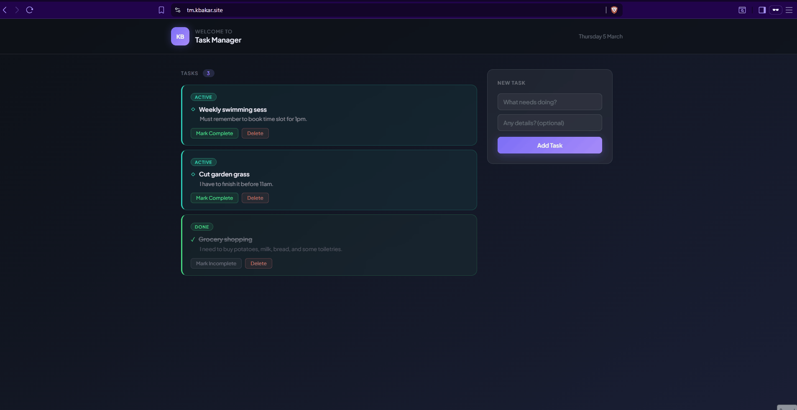
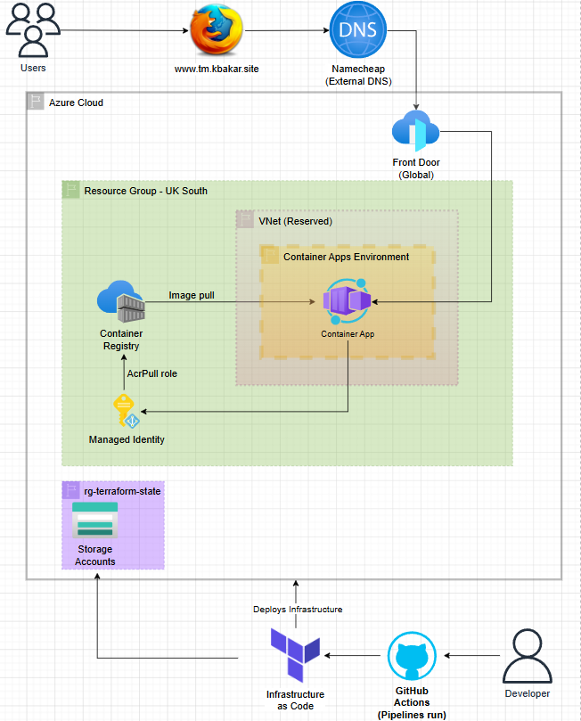
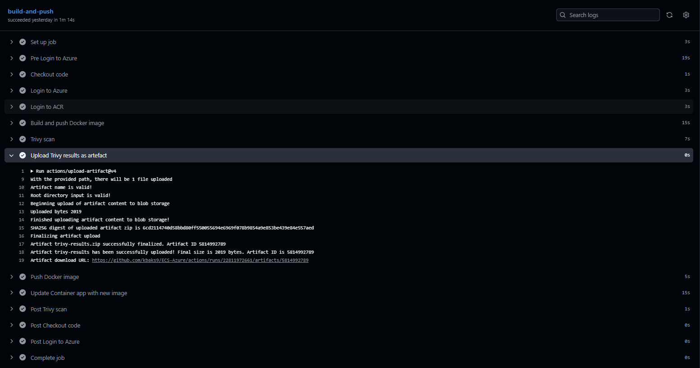
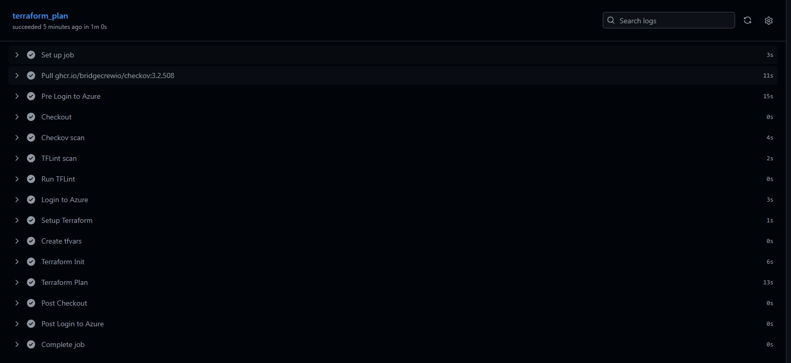
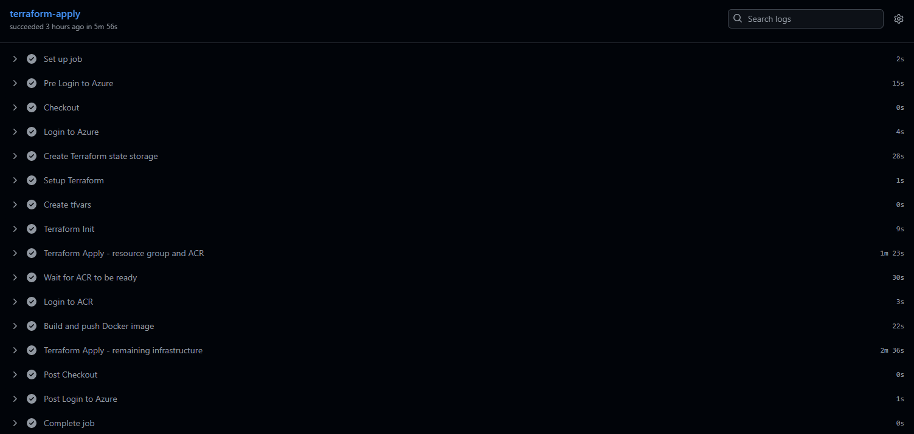
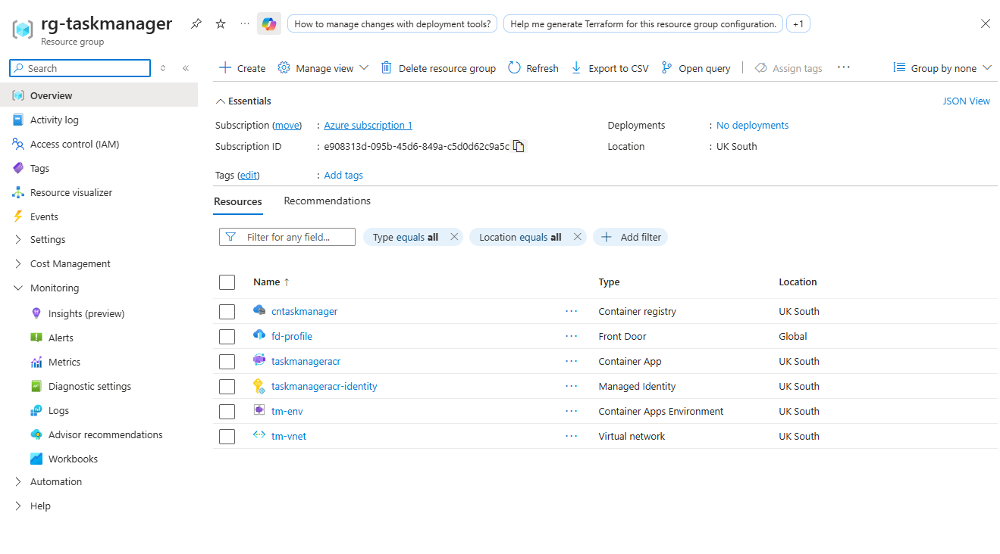
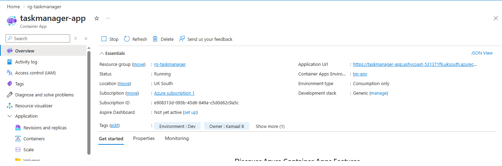

# taskflow-azure

This project is a cloud-native Task Management Application built to demonstrate and strengthen my understanding of modern cloud engineering practices. While the application enables users to organise and track daily tasks, weekly goals, and ongoing projects, its primary focus is to showcase how a real-world application can be containerised, automated, and deployed using scalable Azure infrastructure.

The application is containerised using Docker and deployed on Azure using Infrastructure as Code (Terraform) and CI/CD pipelines with GitHub Actions. It runs on Azure Container Apps, with Azure Front Door providing secure, scalable access via HTTPS and custom domain routing.

Live at: [tm.kbakar.site](https://tm.kbakar.site)

## Architecture Diagram



The user visits `tm.kbakar.site`, which resolves via a Namecheap CNAME record to Azure Front Door. Front Door handles HTTPS termination with a managed certificate and forwards traffic to the Container App. The Container App pulls its Docker image from Azure Container Registry using a Managed Identity with the AcrPull role, so no credentials are stored anywhere. Terraform state is stored in a separate Azure Storage Account in `rg-terraform-state` to prevent accidental deletion.

## Tech Stack

| Category | Technology |
|---|---|
| Application | Python, Flask |
| Containerisation | Docker (multi-stage Alpine build) |
| Container Registry | Azure Container Registry |
| Hosting | Azure Container Apps |
| CDN / Routing | Azure Front Door (Standard) |
| DNS | Namecheap |
| Infrastructure as Code | Terraform |
| CI/CD | GitHub Actions |
| Security scanning | Trivy, Checkov, tflint |
| State backend | Azure Blob Storage |

## Project Structure

```
taskflow-azure/
├── .github/
│   └── workflows/
│       ├── push-image.yaml        # builds, scans and pushes Docker image
│       ├── terraform-plan.yaml    # runs Checkov, tflint and terraform plan on PRs
│       ├── terraform-apply.yaml   # deploys infrastructure on merge to main
│       └── terraform-destroy.yaml # tears down all resources (manual trigger)
├── app/
│   ├── app.py
│   ├── requirements.txt
│   ├── static/
│   └── templates/
├── terraform/
│   ├── main.tf
│   ├── provider.tf
│   ├── variables.tf
│   └── modules/
│       ├── az_container_app/
│       ├── az_container_registry/
│       ├── front_door/
│       ├── network/
│       └── role_assignment/
├── Dockerfile
└── README.md
```

## Pipelines

| Pipeline | Trigger | What it does |
|---|---|---|
| `push-image` | Push to main (`app/` or `Dockerfile`) | Builds image, Trivy scan, pushes to ACR, updates Container App |
| `terraform-plan` | PR to main (`terraform/`) | Checkov, tflint, terraform plan |
| `terraform-apply` | Push to main (`terraform/`) | Provisions ACR, builds image, deploys remaining infrastructure |
| `terraform-destroy` | Manual | Tears down all resources in `rg-taskmanager` |

### Push image with Trivy scan


### Terraform plan with checkov and tflint


### Terraform apply with provisioning


### Terraform destroy with manual trigger

## Security

Trivy scans the Docker image for vulnerabilities on every push and uploads results as a downloadable artefact. Checkov scans Terraform for security misconfigurations on every PR, the 8 findings are acknowledged as Basic SKU limitations and are not applicable for this project. tflint checks Terraform code quality and Azure-specific rules. Managed Identity is used for ACR authentication so no passwords or secrets are stored in code. HTTPS is enforced by default via Front Door with an automatically provisioned managed certificate.

## Azure Resources

All resources are in `rg-taskmanager` (UK South) except the Terraform state backend.

| Resource | Type | Purpose |
|---|---|---|
| `crtaskmanager` | Container Registry | Stores Docker images |
| `taskmanager-app` | Container App | Runs the Flask application |
| `tm-env` | Container Apps Environment | Hosts the Container App |
| `fd-profile` | Front Door | HTTPS, custom domain, routing |
| `taskmanager-app-identity` | Managed Identity | AcrPull access to Container Registry |
| `tm-vnet` | Virtual Network | Reserved for future private networking |
| `sataskmanagertfstate` | Storage Account | Terraform state (`rg-terraform-state`) |

### Resources within rg-taskmanager


### Container App overview


## Run Locally

Prerequisites: Docker, Python 3.12

```bash
git clone https://github.com/kbaks9/taskflow-azure.git
cd taskflow-azure
```

Run with Docker:

```bash
docker build -t taskflow .
docker run -p 8080:8080 taskflow
```

Visit `http://localhost:8080`.

Run without Docker:

```bash
cd app
pip install -r requirements.txt
python app.py
```

## Deploying the Infrastructure

The infrastructure deploys automatically via GitHub Actions on push to main. To deploy manually, ensure the Azure CLI is authenticated and run:

```bash
cd terraform
terraform init
terraform apply -var-file="terraform.tfvars"
```

To destroy:

```bash
terraform destroy -var-file="terraform.tfvars"
```

The Terraform state storage in `rg-terraform-state` is managed separately and will not be destroyed by this command.

## Required GitHub Secrets

| Secret | Description |
|---|---|
| `AZURE_CLIENT_ID` | Service principal client ID |
| `AZURE_CLIENT_SECRET` | Service principal client secret |
| `AZURE_SUBSCRIPTION_ID` | Azure subscription ID |
| `AZURE_TENANT_ID` | Azure tenant ID |
| `TF_RESOURCE_GROUP` | Resource group name |
| `TF_LOCATION` | Azure region |
| `TF_CR_NAME` | Azure Container Registry name |
| `TF_APP_NAME` | Container App name |
| `TF_ENV_NAME` | Container Apps Environment name |
| `TF_CONTAINER_NAME` | Container name |
| `TF_IMAGE_TAG` | Docker image tag |
| `TF_VAR_CPU` | CPU allocation name |
| `TF_INT_MEMORY` | Memory allocation name |
| `TF_PROFILE_NAME` | Front Door profile name |
| `TF_SKU_NAME` | Front Door SKU |
| `TF_EP_NAME` | Front Door endpoint name |
| `TF_FD_GROUP_NAME` | Front Door origin group name |
| `TF_FD_ORIGIN_NAME` | Front Door origin name |
| `TF_FD_ROUTE_NAME` | Front Door route name |
| `TF_CUSTOM_NAME` | Custom domain resource name |
| `TF_CUSTOM_DOMAIN_NAME` | Custom domain |
| `TF_VNET_NAME` | Virtual network name |
| `TF_VNET_ADDRESS_SPACE` | VNet address space |
| `TF_SUBNET_NAME` | Subnet name |
| `TF_SUBNET_PREFIX` | Subnet prefix |

## Author

[Kamaal Bakar](https://www.linkedin.com/in/kamaal-bakar/)
